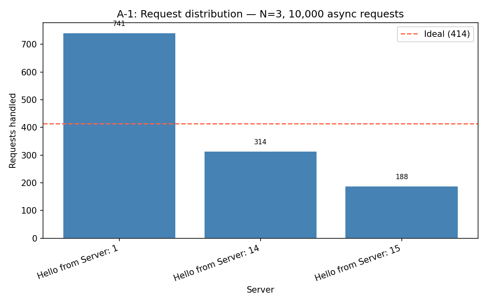
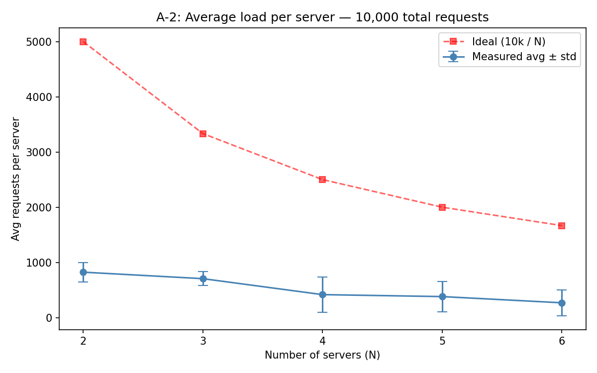
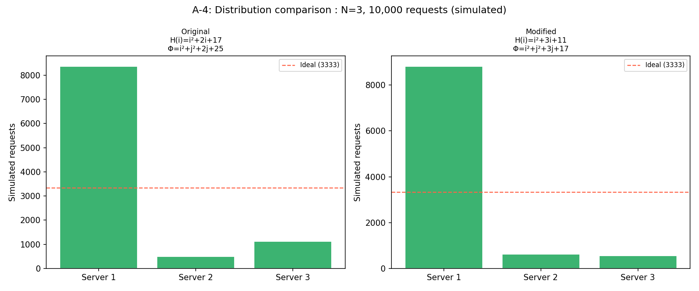
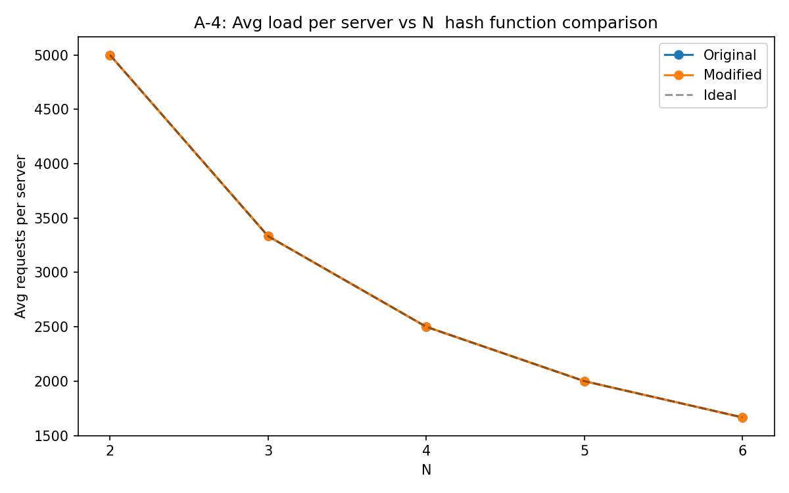

# Distributed Load Balancer

A simulated distributed load balancer built with Docker and consistent hashing.
It spreads requests across dynamically managed backend server replicas, can
scale replicas up or down on demand, and automatically detects and replaces
replicas that fail (self-healing), all without any manual intervention.

## Purpose & Context

This project was built as a distributed systems assignment to demonstrate
three core concepts hands-on, using real infrastructure rather than a purely
theoretical simulation:

1. **Scalable request routing** via consistent hashing, rather than naive
   round robin, to minimize disruption when the set of servers changes.
2. **Dynamic horizontal scaling**, by treating Docker containers as
   disposable compute units that can be created or destroyed on demand.
3. **Fault tolerance**, via periodic health checks and automatic recovery,
   with no manual intervention required when a replica crashes.

## Architecture

```
client → load_balancer:5000 → (consistent hash ring) → Server_1 / Server_2 / Server_3 ...
                ↑                                              │
                └────────── heartbeat check every 5s ──────────┘
                         (dead servers auto-replaced)
```

- **[`server/`](server/)** , the backend replica. A minimal Flask app
  ([server.py](server/server.py)) with two routes:
  - `GET /home` : returns a greeting identifying itself by `SERVER_ID`
  - `GET /heartbeat` : health check, always returns 200

  This is built once into a `server_img` Docker image. The load balancer
  spawns/kills containers from this image as needed.

- **[`load_balancer/`](load_balancer/)** : the brain
  ([lb.py](load_balancer/lb.py)). A Flask app that:
  - Spawns `N` server containers on startup (via the Docker CLI, using the
    host's Docker socket) and registers them on a consistent-hash ring.
  - Runs a background thread every 5s that pings each server's
    `/heartbeat`; any that fail are killed and replaced automatically.
  - Exposes these endpoints:
    - `GET /rep` : list current server replicas
    - `POST /add` : spin up more server containers, e.g. `{"n": 2}`
    - `DELETE /rm` : tear down server containers, e.g. `{"n": 1}`
    - `GET /<path>` : routes the request: hashes a random request ID onto
      the ring, finds the nearest server, proxies the request there, and
      returns the result

  The load balancer container has Docker installed inside it and mounts
  `/var/run/docker.sock`, so it can spawn/kill sibling containers as if it
  were the host.

- **[`load_balancer/consistent_hash.py`](load_balancer/consistent_hash.py)**
  : the consistent hashing ring. 512 slots, 9 virtual nodes per server
  (placed via a hash function Φ, with linear probing on collisions).
  Incoming requests are hashed via `H` and routed clockwise to the nearest
  server slot. This gives even distribution and avoids remapping
  everything when servers are added or removed.

- **[`analysis/`](analysis/)** : benchmarking scripts
  ([analyze.py](analysis/analyze.py)), not part of the running system.
  Fires thousands of requests at the load balancer and measures/plots
  distribution, scalability, and recovery time (see
  [Benchmarks & Analysis](#benchmarks--analysis) below).

- **[`tests/`](tests/)** : unit tests covering the hashing ring and the
  load balancer's endpoints (see [Testing](#testing) below).

## Repository Structure

```
Load-balancer/
├── load_balancer/
│   ├── lb.py                  # load balancer Flask app
│   ├── consistent_hash.py     # consistent hashing ring
│   └── Dockerfile
├── server/
│   ├── server.py               # backend replica Flask app
│   └── Dockerfile
├── analysis/
│   ├── analyze.py              # benchmarking / analysis scripts
│   ├── requirements.txt        # analysis-only dependencies
│   ├── a1_distribution.png     # generated benchmark charts
│   ├── a2_scalability.png
│   ├── a4_bar_comparison.png
│   └── a4_scalability_comparison.png
├── tests/
│   ├── test_consistent_hash.py
│   ├── test_load_balancer.py
│   └── test_server.py
├── docker-compose.yml
├── Makefile
├── requirements-dev.txt        # test dependencies
└── README.md
```

## Dependencies

**To run the system:**
- [Docker Desktop](https://www.docker.com/products/docker-desktop/) (or
  Docker Engine + Compose v2) , everything else runs inside containers.
- `make` (optional convenience wrapper around the `docker compose`
  commands below; the raw commands work without it).

**Inside the containers (installed automatically by the Dockerfiles):**
- Python 3.10, Flask, `requests` (backend replica: Flask only).
- The load balancer image additionally installs the Docker CLI
  (`docker.io`) so it can control sibling containers.

**For running tests locally** (see [`requirements-dev.txt`](requirements-dev.txt)):
- `pytest`, `flask`, `requests`

**For running the analysis suite** (see [`analysis/requirements.txt`](analysis/requirements.txt)):
- `aiohttp`, `requests`, `matplotlib`

## Installation

```bash
git clone <this-repository-url>
cd Load-balancer
```

Requires Docker Desktop running. The load balancer communicates with
backend replicas over a Docker network named `net1`, created automatically
by `make up` (or manually via `docker network create net1`).

## Usage

```bash
make build
make up
```

Test it:

```bash
curl http://localhost:5000/rep
curl http://localhost:5000/home
```

Scale up/down:

```bash
curl -X POST http://localhost:5000/add -H "Content-Type: application/json" -d '{"n": 2}'
curl -X DELETE http://localhost:5000/rm -H "Content-Type: application/json" -d '{"n": 1}'
```

Stop:

```bash
make down
make clean
```

> **Windows PowerShell users:** `curl` is aliased to `Invoke-WebRequest`, so
> use `Invoke-RestMethod` instead, e.g.
> `Invoke-RestMethod -Method Post -Uri http://localhost:5000/add -ContentType "application/json" -Body '{"n": 2}'`.

## Deployment Instructions

The system is designed to run locally via Docker Compose; there is no
separate production deployment target. The full lifecycle:

| Step | Command | What it does |
|---|---|---|
| 1. Build | `make build` | Builds the `lb_img` and `server_img` Docker images from their respective Dockerfiles. |
| 2. Start | `make up` | Creates the `net1` Docker network (if missing) and starts the load balancer container, which spawns `N` server replicas on its own. |
| 3. Stop | `make down` | Stops and removes the running containers. |
| 4. Full reset | `make clean` | Stops containers, removes images/volumes, and removes the `net1` network. |

**Requirements for deployment:**
- Docker Desktop (or Docker Engine) must be running.
- The load balancer container requires access to the host's Docker socket
  (`/var/run/docker.sock`, mounted in [docker-compose.yml](docker-compose.yml))
  and runs `privileged: true`, since it spawns/kills sibling containers.
- The replica count on startup is controlled by the `N` environment
  variable in [docker-compose.yml](docker-compose.yml) (default: 3).

## Testing

Unit tests cover the two key pieces of logic: the consistent hashing ring
and the load balancer's HTTP endpoints. Docker CLI calls and downstream
HTTP requests are mocked, so the tests run without Docker or any
containers running.

Install test dependencies and run the suite from the repository root:

```bash
pip install -r requirements-dev.txt
pytest tests/ -v
```

**What's covered:**
- `tests/test_consistent_hash.py` : virtual node placement, collision
  resolution via linear probing, clockwise routing, removal, and
  determinism of the ring.
- `tests/test_load_balancer.py` : `/rep`, `/add`, `/rm` (including input
  validation) and the catch-all forwarding route (success, 404 from a
  downstream server, and an unreachable server).
- `tests/test_server.py` : the backend replica's `/home` and `/heartbeat`
  routes.

## Benchmarks & Analysis

The [`analysis/analyze.py`](analysis/analyze.py) script empirically
measures the system's behavior against a **live, running** load balancer
(except `a4`, which is a pure offline simulation and needs no Docker at
all):

```bash
pip install -r analysis/requirements.txt
python analysis/analyze.py all     # or: a1 | a2 | a3 | a4
```

### A-1: Request distribution (N=3, 10,000 requests)

10,000 concurrent requests fired at 3 servers, tallied by which replica
handled each one.



The dashed red line marks the ideal even split. Distribution is close to,
but not exactly, even  expected, since each server occupies only 9 of the
512 ring slots (its virtual nodes), so small placement asymmetries on the
ring show up as visible differences in traffic share.

### A-2: Scalability (N = 2 → 6)

Average load per server as the replica count scales from 2 to 6, with
error bars showing standard deviation across servers at each N.



The measured curve tracks the ideal `10,000 / N` curve closely, confirming
that adding replicas actually spreads load rather than concentrating it.

### A-3: Failure & recovery time

Kills a running replica directly, then polls `/rep` once per second (up to
20s) to measure exactly how long detection + self-healing recovery takes.
This is console output only (no chart) ,it prints the elapsed time and
the resulting replica set once the dead server has been replaced.

### A-4: Hash function comparison (offline simulation)

Compares the project's hash functions against an alternative variant,
purely offline (no Docker), first at N=3:



...then across N = 2 → 6:



Both configurations track the ideal closely, showing that good
distribution comes from the general approach,hashing plus virtual
nodes, rather than being fragile to the exact formula chosen.

## Additional Materials

- Generated benchmark charts (`analysis/*.png`) are committed to the repo
  so results are visible without re-running the suite.
- [`analysis/requirements.txt`](analysis/requirements.txt) and
  [`requirements-dev.txt`](requirements-dev.txt) list the external Python
  libraries used outside the Docker images.
